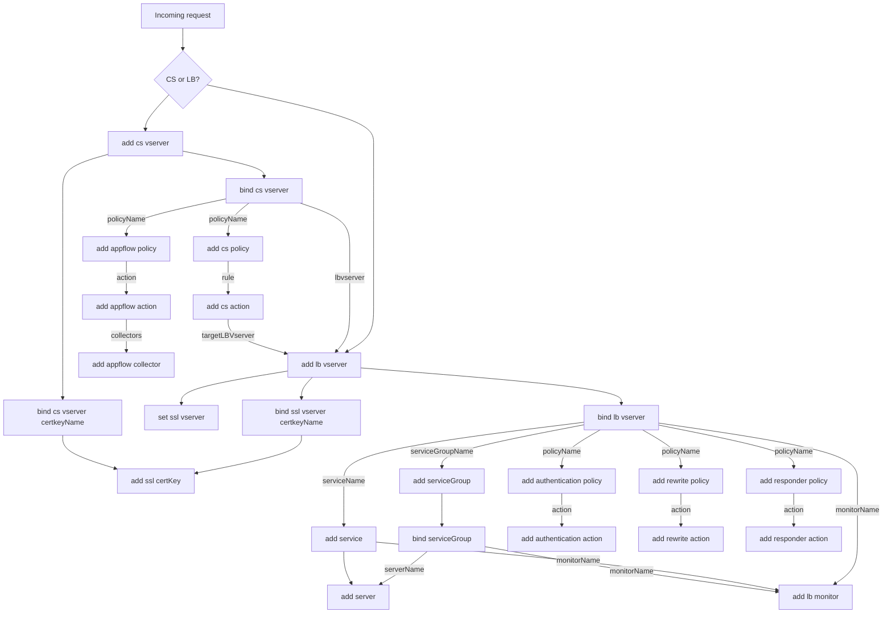

# F5 Flipper Roadmap

This document provides the technical architecture, development roadmap, and detailed implementation notes for F5 Flipper.

[Back to Main README](README.md)

---

## Table of Contents

- [Project Phases](#project-phases)
- [Architecture Overview](#architecture-overview)
- [Configuration Breakdown Process](#configuration-breakdown-process)
- [Application Abstraction](#application-abstraction)
- [NetScaler to F5 Mapping](#netscaler-to-f5-mapping)
- [Protocol/ServiceType Reference](#protocolservicetype-reference)
- [Implementation Notes](#implementation-notes)
- [Future Enhancements](#future-enhancements)
- [Resources](#resources)

---

## Project Phases

### Phase 1: Archive Unpack and Config Parsing ✅ Complete

Parse NetScaler configuration files and archives into structured JSON.

**Key Capabilities:**
- Unpack `.tgz` archives and extract `.conf` files
- Stream processing for large archives
- Parse config lines into predictable JSON structure
- Sort config lines by verb order: `add` → `set` → `bind` → `link` → `enable` → `disable`

**Implementation:** [`src/CitrixADC.ts`](src/CitrixADC.ts), [`src/unPackerStream.ts`](src/unPackerStream.ts), [`src/regex.ts`](src/regex.ts)

---

### Phase 2: Application Abstraction ✅ Complete

Extract applications and their dependencies from parsed configuration.

**Key Capabilities:**
- Walk Content Switching (CS) virtual servers
- Walk Load Balancing (LB) virtual servers
- Walk Global Server Load Balancing (GSLB) configurations
- Extract all dependencies: monitors, pools, certificates, policies
- Support for NetScaler v10 through v13.1+

**Implementation:**
- [`src/digLbVserver.ts`](src/digLbVserver.ts) - LB virtual servers
- [`src/digCsVserver.ts`](src/digCsVserver.ts) - CS virtual servers
- [`src/digGslbVserver.ts`](src/digGslbVserver.ts) - GSLB virtual servers
- [`src/digGslbService.ts`](src/digGslbService.ts) - GSLB services
- [`src/digCStoLbRefs.ts`](src/digCStoLbRefs.ts) - CS to LB references

---

### Phase 3: Analytics/Diagnostics ✅ Complete

Analyze abstracted applications and provide feature detection.

**Key Capabilities:**
- 40+ diagnostic rules with technology-specific prefixes
- Feature detection for SSL/TLS, persistence, load balancing, security
- VS Code diagnostics integration with color-coded severity levels
- Per-application diagnostic reporting

**Rule Categories:**
- SSL/TLS configurations
- Load balancing methods
- Persistence settings
- Health monitoring
- Security policies (WAF, authentication, authorization)
- Performance features (compression, caching)
- Protocol-specific features (HTTP, FTP, DNS)

**Implementation:** [`src/nsDiag.ts`](src/nsDiag.ts)

---

### Phase 4: Conversion Outputs ✅ Complete

Generate F5 AS3 declarations using FAST templates.

**Key Capabilities:**
- AS3 output via F5 FAST templates
- Protocol-specific templates (HTTP, SSL, TCP, UDP, DNS, etc.)
- Interactive webview with Monaco editor
- Live AS3 preview and validation
- Parameter munging from NetScaler to FAST format

**Future Expansion:**
- F5 Distributed Cloud (XC) conversion outputs
- NGINX configuration snippets
- Enhanced template coverage for advanced features

**Implementation:**
- [`src/fastCore.ts`](src/fastCore.ts) - FAST template integration
- [`src/fastWebView.ts`](src/fastWebView.ts) & [`src/fastWebViewFull.ts`](src/fastWebViewFull.ts) - Interactive webviews
- [`templates/as3/`](templates/as3/) - AS3 FAST templates

---

## Architecture Overview

### Configuration Processing Pipeline

```
┌─────────────────┐
│  .conf / .tgz   │
└────────┬────────┘
         │
         ▼
┌─────────────────┐
│   UnPacker      │  Stream archive, extract .conf files
└────────┬────────┘
         │
         ▼
┌─────────────────┐
│  Regex Parser   │  Sort by verbs, convert to JSON tree
└────────┬────────┘
         │
         ▼
┌─────────────────┐
│   Digesters     │  Walk JSON, abstract applications
└────────┬────────┘
         │
         ▼
┌─────────────────┐
│  Diagnostics    │  Analyze features, provide rules
└────────┬────────┘
         │
         ▼
┌─────────────────┐
│ FAST Templates  │  Generate AS3 output
└─────────────────┘
```


### Key Components

**ADC Class** ([`src/CitrixADC.ts`](src/CitrixADC.ts))
- Main orchestrator
- Manages unpacking, parsing, abstraction pipeline
- EventEmitter for async processing

**RegExTree** ([`src/regex.ts`](src/regex.ts))
- Defines patterns for all NetScaler object types
- Converts config lines to nested JSON structure

**Digesters** (Process Flow)
1. Start with each virtual server (CS/LB/GSLB)
2. Gather SSL settings (`set ssl vserver`)
3. Gather bindings (`bind lb vserver`, `bind cs vserver`)
4. Follow references to pools (`add serviceGroup`, `add service`)
5. Extract pool members and servers
6. Collect monitors (`add lb monitor`)
7. Gather policies (authentication, rewrite, responder, etc.)

**VS Code Integration**
- [`src/extension.ts`](src/extension.ts) - Extension entry point
- [`src/nsCfgViewProvider.ts`](src/nsCfgViewProvider.ts) - Tree view for configs
- [`src/templateViewProvider.ts`](src/templateViewProvider.ts) - Template explorer

---

## Configuration Breakdown Process

### 1. Archive Unpack

If file is `.conf`, skip to step 2. For `.tgz` archives:
- Stream archive contents
- Capture all `.conf` files
- Extract certificates (optional)
- Extract logs (optional)

### 2. Parse Config into JSON

Sort config lines by verb order:

```
add → set → bind → link → enable → disable
```

Convert each line to JSON structure:

```
<verb> (<type>|<type> <subType>) <name> (<details>|<options>|<references>)
```

**Example NetScaler Config:**

```
add lb vserver app1-80-vsrv HTTP 10.1.1.100 80
add lb vserver app1-443-vsrv SSL 10.1.1.100 443
add ssl certKey cert1 -cert /cert1.crt -key /cert1.key
bind ssl vserver app1-443-vsrv -certkeyName cert1
bind lb vserver app1-443-vsrv service1
```

**Resulting JSON Structure:**

```json
{
  "add": {
    "lb": {
      "vserver": {
        "app1-80-vsrv": "HTTP 10.1.1.100 80",
        "app1-443-vsrv": "SSL 10.1.1.100 443"
      }
    },
    "ssl": {
      "certKey": {
        "cert1": "-cert /cert1.crt -key /cert1.key"
      }
    }
  },
  "bind": {
    "ssl": {
      "vserver": {
        "app1-443-vsrv": "-certkeyName cert1"
      }
    },
    "lb": {
      "vserver": {
        "app1-443-vsrv": "service1"
      }
    }
  }
}
```

Only objects defined in the RegExTree are parsed - everything else is left behind.

---

## Application Abstraction

### Content Switching (CS) Virtual Servers

1. Start with `add cs vserver`
2. Add SSL options from `bind cs vserver` (certificate bindings)
3. Extract policies from `bind cs vserver` (policy bindings)
4. Follow policy references:
   - `add cs policy` → `add cs action` → target LB vserver
   - Direct LB vserver references
5. For each referenced LB vserver, perform LB abstraction

### Load Balancing (LB) Virtual Servers

1. Start with `add lb vserver`
2. Add SSL settings from `set ssl vserver`
3. Add certificate bindings from `bind ssl vserver`
4. Extract pool bindings from `bind lb vserver`
5. For service groups:
   - Get details from `add serviceGroup`
   - Get bindings from `bind serviceGroup`
   - Extract server references
6. For services:
   - Get details from `add service`
   - Extract server references
7. Collect monitors from bindings
8. Extract policies:
   - Authentication policies → actions
   - Rewrite policies → actions
   - Responder policies → actions
   - AppFlow policies → actions → collectors

### Global Server Load Balancing (GSLB)

1. Start with `add gslb vserver`
2. Extract GSLB service bindings
3. Follow service references to sites
4. Collect monitors and policies

---

## NetScaler to F5 Mapping

### Object Relationship Flow



---

## Protocol/ServiceType Reference

### Content Switching Virtual Server ServiceTypes

Reference: [NetScaler CS VServer Documentation](https://developer-docs.netscaler.com/en-us/adc-command-reference-int/13/cs/cs-vserver.html)

**Syntax:** `add cs vserver <name> <serviceType> [<IPAddress> <port>]`

| NS ServiceType | F5 Profiles | Optional F5 Profiles |
|:---|---:|:---:|
| HTTP | TCP/HTTP | - |
| SSL | TCP/HTTP/clientssl | serverssl |
| TCP | TCP | - |
| FTP | TCP | - |
| RTSP | TCP/RTSP | - |
| SSL_TCP | TCP/clientssl | serverssl |
| UDP | UDP | - |
| DNS | UDP | dns |
| SIP_UDP | UDP | SIP |
| SIP_TCP | TCP | SIP |
| SIP_SSL | TCP/clientssl | SIP |
| ANY | TCP | - |
| RADIUS | UDP | RADIUS |
| RDP | TCP | - |
| MYSQL | TCP | - |
| MSSQL | TCP | - |
| DIAMETER | TCP | Diameter |
| SSL_DIAMETER | TCP/clientssl | Diameter |
| DNS_TCP | TCP | DNS |
| ORACLE | TCP | - |
| SMPP | TCP | - |
| PROXY | ? | - |
| MONGO | ? | - |
| MONGO_TLS | TCP/clientssl | - |
| MQTT | - | - |
| MQTT_TLS | TCP/clientssl | - |
| HTTP_QUIC | - | - |

### Load Balancing Virtual Server ServiceTypes

Reference: [NetScaler LB VServer Documentation](https://developer-docs.netscaler.com/en-us/adc-command-reference-int/13/lb/lb-vserver)

**Syntax:** `add lb vserver <name> <serviceType> [<IPAddress> <port>]`

| NS ServiceType | F5 Profiles | Optional F5 Profiles |
|:---|---:|:---:|
| HTTP | TCP/HTTP | - |
| FTP | TCP | - |
| TCP | TCP | - |
| UDP | UDP | - |
| SSL | TCP/clientssl | serverssl/HTTP |
| SSL_BRIDGE | TCP/clientssl | FastL4/serverssl |
| SSL_TCP | TCP/clientssl | serverssl |
| DTLS | UDP/clientssl | - |
| NNTP | TCP | - |
| DNS | UDP | dns |
| DHCPRA | TCP | dhcpv4 |
| ANY | TCP | - |
| SIP_UDP | UDP | SIP |
| SIP_TCP | TCP | SIP |
| SIP_SSL | TCP/clientssl | SIP |
| DNS_TCP | TCP | DNS |
| RTSP | TCP | RTSP |
| RADIUS | UDP | RADIUS |
| RDP | TCP | - |
| MYSQL | TCP | - |
| MSSQL | TCP | - |
| DIAMETER | TCP | Diameter |
| SSL_DIAMETER | TCP/clientssl | Diameter |
| TFTP | UDP | - |
| ORACLE | TCP | - |
| SMPP | TCP | - |
| SYSLOGTCP | TCP | - |
| SYSLOGUDP | UDP | - |
| FIX | TCP | - |
| SSL_FIX | TCP/clientssl | - |
| PROXY | TCP | - |
| USER_TCP | TCP | - |
| USER_SSL_TCP | TCP/clientssl | - |
| QUIC | UDP | HTTP/3 |
| IPFIX | UDP | - |
| LOGSTREAM | TCP | - |
| MONGO | TCP | - |
| MONGO_TLS | TCP/clientssl | - |
| MQTT | TCP | - |
| MQTT_TLS | TCP/clientssl | - |
| QUIC_BRIDGE | UDP | - |
| HTTP_QUIC | UDP | HTTP/3 |

---

## Implementation Notes

### Critical Parsing Rules

- All `add` operations must happen before `bind` operations
- Config lines sorted by verb: `add` → `set` → `bind` → `link` → `enable` → `disable`
- `0.0.0.0:0` in NetScaler = Non-Addressable (only accessible via CS vserver)
- `add service` defines a single destination
- `add serviceGroup` defines a pool of destinations

### NetScaler File Types

- `.conf` - Main config files (one command per line, unlike TMOS)
- `.tgz` - Archive files (full and basic backups)
- `.log` - Log files
- Certificates typically in `/nsconfig/ssl/`

### Objects with IP Addresses (Customer-Specific)

```
add ns ip <ip>
bind vlan <id> -IPAddress <ip>
add snmp trap generic <ip>
add server <name> <ip>
add lb vserver <name> <type> <ip> <port>
add cs vserver <name> <type> <ip> <port>
add gslb site <name> <ip>
set ns rcpNode <ip>
```

**Front-door indicators:** `add lb vserver` and `add cs vserver` define application entry points.

### Special Features Not Abstracted

- **NetScaler WAF** - Rarely used, not on roadmap
  - Recommendation: Apply modern WAF policy on F5
- **AppFlow** - Application telemetry
  - XC has built-in analytics
  - TMOS: Use Application Visibility and Reporting (AVR) or Telemetry Streaming (TS)
  - NGINX: Prometheus endpoints

---

## Future Enhancements

See [PROJECT_ORCID.md](PROJECT_ORCID.md) for the next phase of major updates, including:

- Complete JSON conversion engine redesign
- Extended unit test coverage
- Production config testing with sanitization
- Enhanced diagnostics for comprehensive feature detection
- JSON output webview with Monaco integration
- Documentation website

---

## Resources

### NetScaler Documentation

- [Command Reference](https://developer-docs.netscaler.com/en-us/adc-command-reference-int/13/)
- [Gateway Virtual Servers](https://docs.netscaler.com/en-us/citrix-gateway/current-release/install-citrix-gateway/configure-citrix-gateway-settings/create-gateway-virtual-servers.html)
- [Firmware Release Cycle](https://support.citrix.com/article/CTX241500/citrix-adc-firmware-release-cycle)
- [Product Lifecycle Matrix](https://www.citrix.com/support/product-lifecycle/product-matrix.html)
- [How to Obtain nsconf File](https://support.citrix.com/article/CTX222891/how-to-obtain-nsconf-file-from-netscaler)
- [Config Copy Between Devices](https://support.citrix.com/article/CTX216729/netscaler-how-to-copy-config-from-old-device-to-new-device)

### NetScaler Version Support

**Current Focus:** v12.1+ (most recent version to fall off maintenance)

| Product | Version | GA Date | EOM | EOL |
|:---|:---:|:---:|:---:|:---:|
| NetScaler Firmware | 13.1 | 15-Sep-21 | 15-Sep-25 | 15-Sep-26 |
| NetScaler Firmware | 13.0 | 15-May-19 | 15-Jul-23 | 15-Jul-24 |
| NetScaler Firmware | 12.1 | 25-May-18 | 30-May-22 | 30-May-23 |

### F5 Documentation

- [F5 Application Services 3 (AS3)](https://clouddocs.f5.com/products/extensions/f5-appsvcs-extension/latest/)
- [F5 FAST Templates](https://github.com/f5networks/f5-appsvcs-templates)
- [F5 FAST Core](https://github.com/f5devcentral/f5-fast-core)

### NGINX Documentation

- [NGINX Migration Guide - Citrix ADC](https://docs.nginx.com/nginx/deployment-guides/migrate-hardware-adc/citrix-adc-configuration/)

### Community Resources

- [John Alam - Citrix NetScaler to F5 BIG-IP](https://community.f5.com/t5/codeshare/citrix-netscaler-to-f5-big-ip/ta-p/277635)
- [Carl Stalhood - NetScaler Scripting](https://www.carlstalhood.com/netscaler-scripting/)
- [Carl Stalhood - Get-ADCVServerConfig](https://github.com/cstalhood/Get-ADCVServerConfig)

---

## Migration Considerations

When evaluating NetScaler to F5 migration, consider:

### Business Requirements
- What are the business goals with the current NS deployment?
- What key features solve business needs?
  - Remote VPN, Load balancing, Authentication, GSLB?
  - Citrix ICA integration (StoreFront, application delivery, RDP/VDI)?
  - Content switching/serving, Caching, SSL offloading?

### Current Challenges
- Lacking features (authentication, load balancing, GSLB)?
- Lacking cloud support or modern architecture integrations (SaaS, K8s)?
- Cost or hardware concerns?

### Organizational Factors
- Has the business need changed since deployment?
- Cap-Ex vs Op-Ex preference?
- Team size managing infrastructure - is this their only focus?
- Openness to retooling?
- Automation strategy?
- DR/Backup strategy?

### Additional Context
- [Citrix ADC EOS Announcement](https://support.citrix.com/article/CTX476864/notice-of-change-announcement-for-perpetual-citrix-adc-eos)
- [Product Lifecycle Matrix](https://www.citrix.com/support/product-lifecycle/product-matrix.html)

---

[Back to Main README](README.md) | [View Changelog](CHANGELOG.md) | [Project Orcid](PROJECT_ORCID.md)
